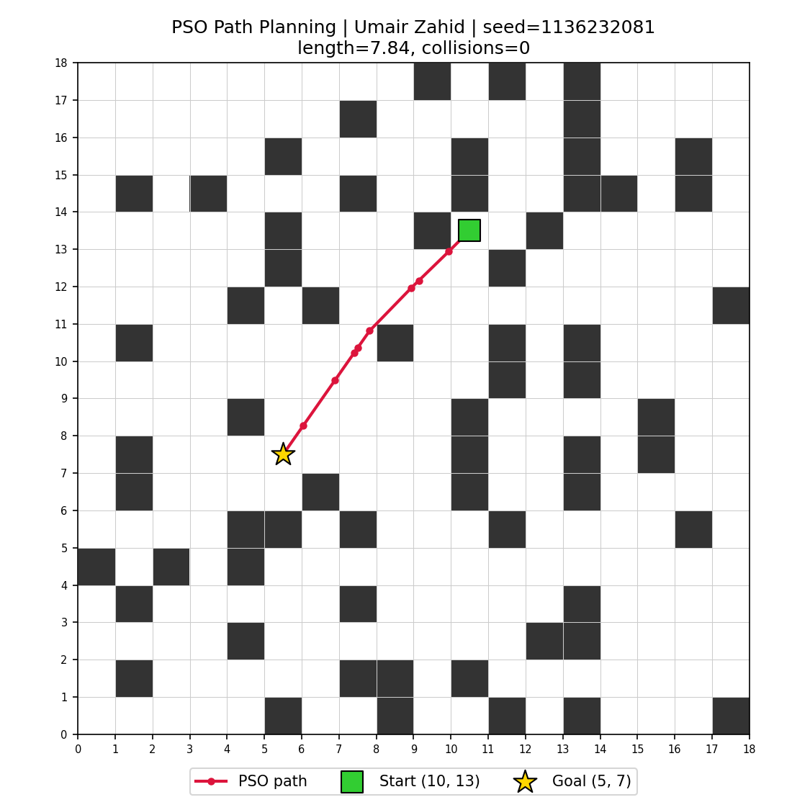
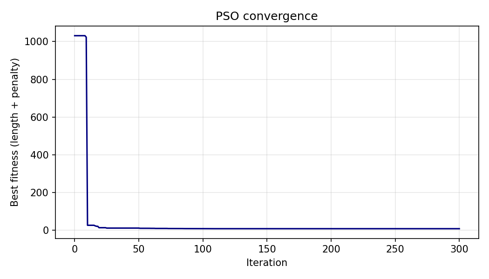

# Swarm-Based Path Planning with Obstacles (PSO)

**Course:** Swarm Intelligence - Lab, Assignment 1

| | |
|---|---|
| **Name** | UMAIR ZHAID  |
| **Roll Number** | 01-136232-081|
| **Random Seed used** | `12345` (seed = 01136232081) |

> The seed is defined in `pso_path_planning.py` as `ROLL_NUMBER = 12345`
> and is used for `random.seed(...)`, `np.random.seed(...)` and the PSO RNG.
> Change it (or pass `--roll`) and a completely different problem is generated.

## Approach

**Problem generation (nothing hardcoded).** From the seed, a 20x20 grid is
created with ~20% random blocked cells. Start and goal are picked at random from
free cells (at least `N/2` Manhattan distance apart). A BFS check guarantees the
instance is solvable (deterministic retry with the same seeded stream).

**Particle encoding.** Each particle is a vector of 8 intermediate waypoints
`[x1,y1,...,x8,y8]` (16 dimensions). The full path is the polyline
`Start -> wp1 -> ... -> wp8 -> Goal`.

**Fitness (minimised).**
`cost = path length + 50 x (number of sampled points on the path that fall inside an obstacle or outside the grid)`.
Each segment is sampled every 0.1 grid units, so a zero-collision path is truly
obstacle-free. The penalty makes infeasible paths far worse than any feasible one.

**PSO.** 120 particles, 300 iterations, inertia weight decreasing linearly 0.9 -> 0.4,
`c1 = c2 = 1.6`, velocity clamping (20% of grid), positions clipped to the grid.
Half of the swarm is initialised around the straight start-goal line, half uniformly
at random for diversity. Because PSO is stochastic, up to 5 independent runs
(seeded `seed + k`) are made and the best is kept. A BFS shortest path (4-connected)
is printed only as a reference baseline.

## Files
```
pso_path_planning.py   main code (generation, PSO, plotting)
requirements.txt       numpy, matplotlib
results/final_path.png final path visualisation
results/convergence.png best-fitness curve
results/result.json    path waypoints, length, collisions
results/output.txt     console output of the run
docs/                  flow-diagram guide
```

## How to run
```bash
git clone <your-repo-url>
cd swarm-pathplanning-12345
pip install -r requirements.txt
python pso_path_planning.py                  # uses ROLL_NUMBER from the file
python pso_path_planning.py --roll 12345 --name "Your Name"
```
Outputs are written to `results/`.

## Results (seed = 12345)
- Start `(11, 5)` -> Goal `(16, 16)`
- **Best path length: 14.62** grid units, **0 collisions** (obstacle-free)
- BFS 4-connected grid baseline: 16 steps (PSO path is shorter because it moves in continuous space / diagonals)





